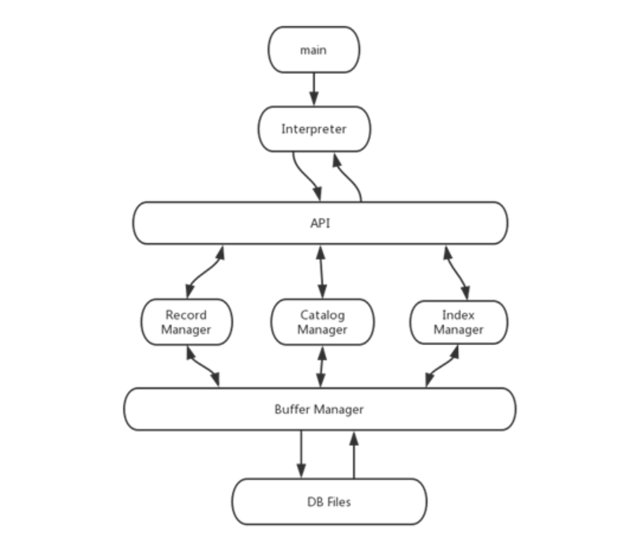
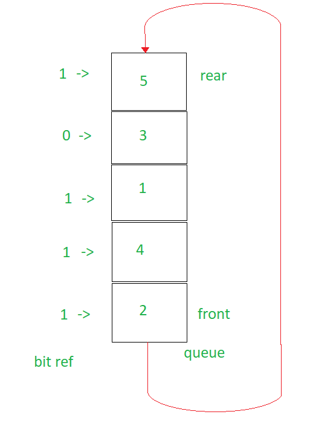
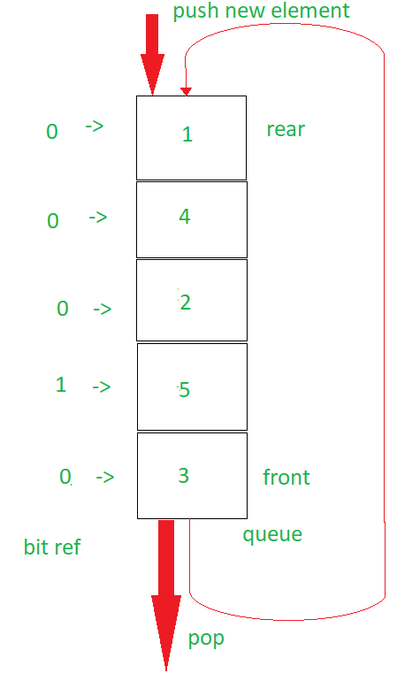

## 1 MiniSQL系统概述

### 1.1 MiniSQL系统实现功能分析

实验要求设计并实现一个单用户 SQL 数据库，允许用户通过字符界面输入SQL 语句实现表的建立/删除，索引的建立/删除，表记录的插入/删除/查找等操作。

$Table$ 要求支持最多可以定义 32 个属性，各属性可以指定是否为 unique，支持单属性的主键定义，对于表的主属性自动建立 B+ 树索引，对于声明为 $unique$ 的属性可以通过 SQL 语句由用户指定建立/删除 B+ 树索引，并且所有 B+ 树索引都是单属性单值。

数据类型分为 $int/float/string$ 三种，可以通过指定用 $and$ 连接的多个条件进行查询，并且支持等值查询和区间查询、每次一条记录的插入操作、每次一条或多条记录的删除操作。需要支持标准的 SQL 语句，包括创建表、删除表、创建索引、删除索引、选择、插入、删除、退出系统、执行 SQL 脚本。其中每一条 SQL 语句以分号结尾，一条 SQL 语句可以为一行或多行，关键字大小写不敏感。

### 1.2 MiniSQL系统体系结构



**图 1.1 MiniSql体系结构**

### 1.3 设计语言与运行环境

**设计语言**：$C++$

**运行环境**：$MSVC -GCC 9.2.0$

# 2 MiniSQL系统结构设计

## 2.1 总体设计：

### 

## 2.2 Interpreter模块：

### 2.4.1 实现功能

$Interpreter$是整个系统的最前端部分，承担了所有的输入输出环节，负责接收用户的输入／文件导入、词法分析、语法分析、返回结果处理与错误信息输出功能。

读入SQL语句：每次读入一行，判断最后一个字符是不是‘；’，如果不是的话，就把它加入到输入的字符串中，继续读入下一行，直到读入的最后一个字符为‘；’则停止输入，最终得到的字符串即为输入的SQL语句。

解析SQL语句：将得到的输出分割成单个的单词或者是符号，如果发现语法上存在错误，就打印错误信息，如果语法没有错误，根据$catalog$的信号，判断是否能够执行该查询，如果不能，打印错误信息，如果可以，就调用API进行执行。

#### 输入／文件导入

$Interpreter$ 支持用户以类命令行的形式输入语句和导入文件执行语句，在输入语句状态下，支持分行输入和多条语句同时输入，对于分行未输入完成的语句，会等待至用户输入的第一个分号。多条语句会按分号分隔执行。通过$execfile$命令可以以标准输入的格式读入文件执行语句。

#### 词法分析

词法分析采用了 $flex$ 来将 $flex$ 的词法标识文件 $interpreter.l$ 转为包含正则表达式匹配与其对应的相应模式处理方法的 $lex.yy.c$ 来进行词法分析，它将对SQL 语句中的关键字(select)、特定符号(>=)、特定格式(int,float,string)等进行匹配。对于关键字和特定格式，返回相应的$token$。

#### 语法分析

语法分析采用了 $bison$ 将语法标识文件 $interpreter.y $转为对应的的能对语句模式的匹配识别的 $yy.tab.c$，生成出的LALR语法分析器可以对输入的SQL语句进行匹配，在匹配成功后创建，匹配失败后返回并输出 $syntax error$。

#### 返回结果处理

 对于语法错误，直接通过解析时的 $yyerror$ 进行错误输出。在检查语义错误阶段，对于 $Catalog$ 报错的情况，$Catch$ 其抛出的错误并且输出错误信息种类，如 $table$ 名不存在/列名不存在等。在 $API$ 执行语句后，如果成功会返回处理后的结果，对其进行格式处理和对齐后，将执行的最终结果输出到屏幕。

### 2.4.2 内部数据形式

#### 查询类

基类$QueryReques$t提供$type$属性记录查询请求的类别，并衍生出多个子类来记录不同类型请求所需要的不同数据。

```C++
/*基类*/
class QueryRequest
{
protected:
    QueryType type;
public:
    virtual ~QueryRequest() = 0;
};
/*select语句涉及表名及select条件集合，由于未要求投影操作的实现故不设置attr_list*/
class SelectQuery final : public QueryRequest
{
public:
    std::string table_name;
    std::vector<Condition> condition_list;
};
/*插入记录涉及插入的表名、插入的值的集合*/
class InsertQuery final : public QueryRequest
{
public:
    std::string table_name;
    std::vector<SQLValue> value_list;
};
/*删除记录涉及删除记录所在的表名、删除条件*/
class DeleteQuery final : public QueryRequest
{
public:
    std::string table_name;
    std::vector<Condition> condition_list;
};
/*建表语句涉及表名、属性名及对应值域、主键名（可选）*/
class CreateTableQuery final : public QueryRequest
{
public:
    std::string table_name;
    std::vector<attrValue> attr_list;
    std::string primary_key_name;
};
/*建立索引涉及表名，属性名，索引名*/
class CreateIndexQuery final : public QueryRequest
{
public:
    std::string table_name;
    std::string attr_name;
    std::string index_name;
};
/*删除表涉及表名*/
class DropTableQuery final : public QueryRequest
{
public:
    DropTableQuery()
    {
        type = QueryType::DROP_TABLE;
    }
    std::string table_name;
};
/*删除索引涉及索引名*/
class DropIndexQuery final : public QueryRequest
{
public:
    std::string index_name;
};
/*执行文件涉及执行文件名称*/
class ExecFileQuery final : public QueryRequest
{
public:
    std::string file_name;
};
```

##### 查询类类型

```C++
enum class QueryType
{
    INSERT,
    DELETE,
    SELECT,
    CREATE_TABLE,
    CREATE_INDEX,
    DROP_TABLE,
    DROP_INDEX,
    EXEC_FILE
};
```

### 辅助定义

##### 值

```C++
enum SQL_TYPE
{
    SQL_INT,
    SQL_CHAR,
    SQL_FLOAT
};
struct SQLValue
{
    SQL_TYPE type;
    int i;
    float r;
    std::string str;
};
```

##### 属性

```C++
class attrtype
{
    SQL_TYPE type;
    bool unique;
    unsigned int size; 
    unsigned char order;
};
```

##### 条件

```C++
enum class Operator
{
    GREATER_THAN,
    GREAT_EQUAL,
    LESS_THAN,
    LESS_EQUAL,
    EQUAL,
    NOT_EQUAL
};
struct Condition 
{
        std::string name;
        Operator op;
        SQLValue val;
};
```

##### 表定义

```C++
class Table
{
public:
    std::map<std::string, common::attrtype> attrs;
    std::string primary_key;
}
```


### 2.4.3 接口

$Interpreter$ 作为最顶层的存在，只向 $main$ 函数提供$read_command_loop$
函数，以 $cin$ 作为输入，对 $cin$ 完成所有的执行操作。

1.$void\ read\_command\_loop()$

读取用户的输入并进行解析直至命令为退出。

### 2.2.4 详细设计

$Flex$生成的词法分析器将输入拆分成一个个记号$token$，$bison$生成的语法分析器根据已有的规则，分析这些$token$的组合，是否符合语法规范。为了实现解释器功能，先在$.y$文件中定义各种$$token$$类型，然后在$.l$文件中通过正则表达式写词汇分析代码，在对应操作中返回$token$类型以和$yacc$进行交互，最后在$.y$文件中写$BNF$来定义语言的规约方式。

### 词法分析

分析合法语句可得，语句中需要判定出来的词包括：整数、浮点数、字符串。其中字符串包括SQL语句关键词、表名索引名属性名等合法字符串、``及“”包括的字符串。

```haskell
/*整数*/
-?{digit}+  				{return Type_INT; }
/*浮点数*/
-?{digit}+"."{digit}* |
-?"."{digit}+ |
-?{digit}+E[-+]?{digit}+    |
-?{digit}+"."{digit}*E[-+]?{digit}+ |
-?"."{digit}*E[-+]?{digit}+  {return Type_FLOAT; }
/*''包括的字符串*/
\"([^\"\n]|(\"\"))*\"       {return Type_DQSTRING; }
/*""包括的字符串*/
`([^\"\n]|(\"\"))*`         {return Type_BSSTRING; }
/*普通字符串/关键词*/
{letter}({letter}|{digit}|_)* {/*判断其是否为关键词，若是，return Key_对应操作否则返回return Type_STRING;*/
/*文件名*/
{letter}({letter}|{digit}|_|-)*(.sql){1} {return Type_FILE; }
/*符号*/
"<"                  {return Type_LT;}
"<="                 {return Type_LE;}
">"                  {return Type_GT;}
">="                 {return Type_GE;}
"="                  {return Type_EQ;}
"!="                 {return Type_NE;}
"<>"                 {return Type_NE;}
```

主要涉及的函数为：

```C++
void yy_switch_to_buffer (YY_BUFFER_STATE new_buffer);
/*将 yyparse 的对象从等待用户输入转换到对 buffer 中内容进行解析。*/
YY_BUFFER_STATE yy_scan_string (yyconst char *yy_str);	
/*将 char* 的字符串进行scan操作并返回 YY_BUFFER_STATE 类型。*/
```

利用$yy\_switch\_to\_buffer(yy\_scan\_string(standard\_input));$将标准输入所生成的$standard\_input$传送至$flex$中进行词法分析。

### 语法分析

分析合法语句可得，$token$包括SQL语句关键词（create等），符号（LE等），数据类型（整型、浮点、字符串）。语法根据特定语句而定，在此以select为例进行介绍，阅读顺序为从下至上，已经对源码已做了一定简化。

首先将各个符号规约为operator，数据类型规约为value，然后将operator和value和字符串规约至condition，将condition通过AND规约至condition_list，最后利用关键词select, from，where及Type_BSTRING（允许``包裹的或者直接的字符串）、condition_list规约为query类型。再将其抽象至top_sentence后为返回YYACCEPT表示结束本次解析。

在解析过程中会涉及数据结构的生成和定义，包括Condition、std::vector\<Condition>等，在解析时将外部输入的值传入至数据结构中，并最终将其组合为当前查询类型的对应属性，从而生成一个包含了命令中所有信息的请求通过全局变量返回给调用者。

```haskell
top_sentence: top_stmt ';' { YYACCEPT; };
top_stmt:dml;
dml:query;

/*select * from table_name where ...*/
query: Key_SELECT '*' Key_FROM Type_BSTRING op_where
    {
        auto select_query = new SelectQuery();
        select_query->table_name = $4;
        select_query->condition_list = $5;

        query = select_query;
    }
    ;
/*where condition and condition and ...*/
op_where: Key_WHERE condition_list
    {
        $$ = $2;
    }
    /*no condition*/
    | nothing
    {
        $$ = std::vector<Condition>();
    }
    ;

condition_list: condition_list Key_AND condition
    {
        $1.push_back($3);
        $$ = $1;
    }
    /*final*/
    | condition
    {
        $$ = std::vector<Condition>();
        $$.push_back($1);
    }
    ;
/*attrname op value*/
condition: Type_BSTRING operator value
    {
        $$.name = $1;
        $$.op = $2;
        $$.val = $3;
    }
    ;
value:
    Type_INT { $$.type = common::attrtype::SQL_INT; $$.i = $1; }
    | Type_REAL { $$.type = common::attrtype::SQL_FLOAT; $$.r = $1; }
    | Type_ASTRING { $$.type = common::attrtype::SQL_CHAR; $$.str = $1; }
    ;
operator:
    Type_LT {   $$ = Operator::LESS_THAN; }
    | Type_LE { $$ = Operator::LESS_EQUAL; }
    | Type_GT { $$ = Operator::GREATER_THAN; }
    | Type_GE { $$ = Operator::GREAT_EQUAL; }
    | Type_EQ { $$ = Operator::EQUAL; }
    | Type_NE { $$ = Operator::NOT_EQUAL; }
    ;
```

## 2.3 API模块：

### 2.3.1 实现功能

$API$模块是整个系统的核心，其主要功能为提供执行SQL语句的接口，供$interpreter$调用。该模块接受$interpreter$提供的解析命令，再根据$catalog$ 的信息，来确定执行规则，并调用$record\ manage$，$index\ manage$，$catalog \ manage$来执行相应的操作，并将结果返回给$interpreter$模块。

### 2.3.2  内部数据形式

#### API类

```C++
class API{
private: 
    static API *api;
    BM::BufferManager buffer_manager;
    CM::CatalogManager catalog_manager;
    IM::IndexManager  index_manager;
    RM::RecordManager record_manager;
    Interpreter interpreter;
public:
    ...
};
```

$API$中包含了$buffer\_manager$,$catalog\_manager$,$index\_manager$,$record\_manager$,$interpreter$的实例作为成员，在运行时通过这些成员调用相应的函数来完成数据库的各项操作。

#### 查询类

$Interpreter$传递查询类至$API$，故此处查询类同$Interpreter$中的基类$QueryRequest$及其七个子类。

### 2.3.3 接口

$API$模块调用$record\ manager$,$index\ manager$，$catalog\ manager$的接口执行SQL语言对应的数据库操作，其提供的执行SQL语言的接口仅为$interpreter$服务。

```C++
1.
static bool dropTable(const std::string &table_name);
/*输入：table_name；
 *输出：操作执行结果；
 *功能：删除table_name的对应的表*/
2.
static bool dropIndex(const std::string &index_name);
/*输入：index_name;
 *输出：操作执行结果；
 *功能：删除index_name的对应的索引*/
3.
static bool createTable(const std::string& table_name,const std::string& primary_key_name, const std::string& primary_index_name);
/*输入：table_name，primary_key_name,primary_index_name
 *输出：操作执行结果；
 *功能：建立名为table_name的表，为其在primary_key_name对应的属性上建立主键，并建立名为primary_index_name的基于主键的索引。*/
4.
static bool createIndex(const std::string &index_name, const std::string &table_name, const std::string& attr_name);
/*输入：index_name,table_name,attr_name；
 *输出：操作执行结果；
 *功能：在table_name对应的表上建立attr_name对应的属性上的名为index_name的索引。*/
5.
static bool deleteOperation(const std::string &table_name, const std::vector<Condition> &condition_list);
/*输入：table_name，condition_list；
 *输出：操作执行结果；
 *功能：在table_name对应的表上进行select操作，找出满足condition_list中所有条件的记录的ID，然后删除这些记录并输出删除记录条数。若条件中包含建立了index的属性，则利用index进行select。*/
6.
static bool insertRecord(const std::string& table_name, const std::vector<SQLValue>value_list);
/*输入：table_name，value_list
 *输出：操作执行结果；
 *功能：在table_name对应的表上插入属性值为value_list中值的记录*/
7.
static bool select(const std::string &table_name, const std::vector<Condition> &condition_list);
/*输入：table_name，condition_list；
 *输出：操作执行结果；
 *功能：在table_name对应的表上根据condition_list筛选出满足所有条件的记录，然后输出这些记录。若条件中包含建立了index的属性，则利用index进行select。*/
```

### 2.3.4 详细设计


## 2.4 CatalogManager模块：

### 2.4.1 实现功能

Catalog Manager负责管理数据库的所有模式信息，包括：

1. 数据库中所有表的定义信息，包括表的名称、表中列数、primary key、定义在该表上    的索引信息。

2. 表中每个字段的定义信息，包括字段类型、是否唯一等。

3. 数据库中所有索引的定义，包括所属表的信息、索引建立在那个字段上等。

Catalog Manager还提供访问及操作上述信息的接口，供Interpreter和API模块使用。

### 2.4.2  内部数据形式

对于表定义，将表名字与表定义的对应储存在一个map中，这样能快速的根据表名称得到相应的表定义。

同样的，也有一个根据表名获得索引名的multimap，这样方便查询表上定义的所有索引，方便我们在drop table时进行快速的操作。

对于索引的定义，将索引名字，与其对应的表名和属性名存入一个map中，这样能快速地获取到索引的相关信息。

### 2.4.3 接口

```cpp
class CatalogManager
{
    // force the catalogmanager to write the information of schemas to the disk
    void forceWrite();

    // get the information of table by its name
    // @param: the name of table
    // @return: if there exists the table with given name, return corresponding Table class
    //          or the value of optional variable is empty
    std::optional<Table> getTableByName(const std::string& table_name) const;

    // get the information of index
    // @param: the index of table
    // @return: if there exists the table with given index, return corresponding index information
    //          or the value of optional variable is empty
    //          first is the table name while second is the attribute name
    std::optional<std::pair<TableName, AttributeName>> getIndex(const std::string& table_index) const;

    // check whether the table with given name exists
    // @param: the name of table need to be checked
    // @return: true if such table exists
    //          false otherwise
    bool checkTableByName(const std::string& table_name) const;

    // check whether the index exists
    // @param: the index of table need to be checked
    // @return: true if such index exists
    //          false otherwise
    bool checkIndex(const std::string& table_name, const std::string& attribute_name) const;

    // create table by giving its name and schema
    // @param: the name of table and a Table variable containing its schema
    // @throw: std::invalid_argument("Table already exists") if there already exists the table with given name
    //         std::invalid_argument(ErrorInfo) if the definition of schema violate some constrain such that the length of char variable exceeds 255
    void createTable(const std::string& table_name, const Table& schema);

    // drop specified table from database by giving its name
    // @param: the name of table
    // @throw: std::invalid_argument("No such table") if there doesn't exist the table with given name
    // @return: all indices' name related to this table
    std::vector<std::string> dropTable(const std::string& table_name);

    // create the index named "index_name" on the column "attr_name" of table "table_name" in Catalog
    // @param: the name of table, the name of attributes to be indexed and the name of index
    // @throw: std::invalid_argument("No such table") if the table name is not valid
    //         std::invalid_argument("Invalid attribute") if the attribute is not available on the table
    //         std::invalid_argument("Existing index") if the index with given name already exists
    void createIndex(const std::string& index_name, const std::string &table_name, const std::string &attr_name);

    // get all indices related to this table
    // @param: the name of the table
    // @throw: std::invalid_argument("No such table") if the table name is not valid
    std::vector<std::string> getAllIndices(const std::string& table_name);

    // get the index name related to given attribute's name
    // @param: the name of the table and attribute's name
    // @throw: std::invalid_argument("No such index") if no index is attached to this attribute
    // @return: the index name if there is such a index
    //          otherwise it returns an empty string
    std::string getIndexName(const std::string& table_name, const std::string& attr_name);

    void dropIndex(const std::string &index_name);
};
```

### 2.4.4 与其他模块的交互方式

本catalog Manager提供接口给其他模块进行索引和表定义内容的增删改的操作。

当其他模块需要使用到表的定义信息时，调用`getTableByName(tablename)` 来获得相应的表定义信息。

当其他模块需要定义新表时，通过提供给`createTable(tablename, schema)` 表名和表定义信息来创建新表。在正式创建之前，Catalog Manager会做相关的一些检查。

当其他模块需要drop掉相关table时，使用`dropTable(tablename)`来进行相关操作。

对于index的操作也类似，不过由于对于需要index信息的场景更多样，Catalog Manager提供了更多类型的API来进行查找工作。

## 2.5 RecordManager模块：

### 2.5.1 实现功能

Record Manager主要针对API的一些请求对Buffer中的Record进行管理，同时返回API所预设的Data类型。通过主要调用Buffer
Manager的函数以及Table类参数对Buffer中指定Block的指定区间进行修改。实现了条件比较，对于int、float、char这3中变量类型的6中比较条件进行定义，并实现无条件和有条件的查找、插入、删除。

### 2.5.2 内部数据形式

### 2.5.3 接口

### 2.5.4 与其他模块的交互方式


## 2.6 Indexmanager模块：

### 2.6.1 实现功能

Index Manager负责B+树索引的实现，可以完成B+树的创建、删除、维护、等值查找、区间查找、插入键值、删除键值等操作，并对外提供相应的接口。（B+树中节点大小应与缓冲区的块大小相同，均为4K，B+树的叉数由节点大小与索引键大小计算得到）。

### 2.6.2 内部数据形式

### 2.6.3 接口

### 2.6.4 与其他模块的交互方式


## 2.7 BufferManager模块：

### 2.7.1 实现功能

Buffer Manager模块是一个独立的，专门管理Buffer，从磁盘文件中读写数据的功能模块。Buffer Manager负责读取Block缓存至Buffer，同时向其他模块提供Buffer访问、读写功能，并能将Buffer中的Block写回磁盘文件中。Buffer Manger管理有限个Block存放在Buffer中，它遵循LRU（最近最少使用）原则。

### 2.7.2 内部数据形式

在Buffer manager内，储存着真实的page文件，共10000个pages，每个page管理特定文件一个4KB(机械硬盘一个扇区的大小)子段的数据，作为一个硬盘数据的cache，将数据暂存到内存中，允许数据库应用获取、更改数据。所以对于数据的格式，Buffer  Manager将忠诚地读取磁盘中的数据，所以用户与buffer manager交互的格式只能是raw data。

对于每个Page的数据，使用一个管理类来包装，提供对外增删改查的接口。并有三个标记`pinned`, `dirty`, `is_open` 分别表示该页是否不能被刷出，是否被修改，是否是硬盘上存在文件的一页。

为了加速查询已有的Page，在类内使用$(filename, pagenum) -> page$ 的map来维护对已有的页面的查询。

### 2.7.3 接口

```cpp
class BufferManager{
    //friend class Page;
public:
    inline bool isFull() noexcept { return file2page.size() < POOLSIZE; }

    // close the file according to the given path
    // all pages of this file in buffer will be flushed away
    // @param: the path to the file to be closed
    // @throw: std::invalid_argument("Invalid file") if the file is not open in the BufferManager
    void closeFile(const std::string &path);

    // delete the file according to the given path
    // @require: there is no page of this file in buffer
    // @param: the path of the file 
    // @throw: std::run_time_error("Fail deleting file") if the funciton fails to delete the file
    void deleteFile(const std::string &path);

    // read specified page of a file according to the path to the file and the index of the page
    // if the file has not been open yet, open the file first
    // if the path does not exist, create an empty file
    // the openmode of file is (in | out | binary)
    // @param: the path to the file and the index of the page
    // @throw: std::out_of_range("Full buffer") exception if the buffer is full and the replacement fails
    //         std::out_of_range("Out of range") if index excess the number of pages of the file
    //         std::runtime_error("Fail opening file") if the file does not be opened properly
    // @return: The pointer to the specifed page in buffer
    Page* getPage(const std::string &path, unsigned int index);

    // query the size of file(in number of pages) without reading it into buffer
    // @param: the path to a specified file
    // @return: the number of pages in this file
    unsigned int fileSize(const std::string &path);

    // get the next page of file relative to current page
    // @param: a page representing the current position
    // @require: the argument passed to the function should be a valid page
    // @throw: std::out_of_range("Full Buffer") exception if the buffer is full and the replacement fails
    // @return: The pointer to the specifed page in buffer
    Page* getNextPage(Page * page);
    // get the previous page of file relative to current page
    Page* getPrevPage(Page *page);
    // get the first page of file relative to current page
    Page* getFirstPage(Page * page);
    // get the last page of file relative to current page
    Page* getLastPage(Page *page);

    // create a new page appending to the tail of the file
    // @param: path to the file 
    // @throw: std::out_of_range("Full Buffer") exception if the buffer is full and the replacement fails
    //         std::runtime_error("Fail opening file") if the file does not be opened properly
    // @return: a pointer to the newly constructed page
    Page* createPage(const std::string &path);

    // close the certain page, throw it out from buffer
    // if the page is dirty write this page back to disk
    // @throw: std::invalid_argument("Invalid page") if the page is invalid
    // @param: a pointer to a specified page
    void close(Page* page);

    // flush all the dirty pages back to disk
    void flush();
};

// A Wrapper for page data
class Page
{
    // modify the data in [beg, end) of the data member
    // and set this page to be dirty
    // @params: the pointer to the date to be copied from, the begin and end position of the data to be modified in this page
    // @throw: std::invalid_argument("Out of range") if beg < 0 or end > PAGESIZE
    //         std::invalid_argument("Invalid page") if this page is invalid
    void modify(char * pdata, int beg, int end);

    // unpin this page to allow the BufferManager to replace it when the buffer is full
    inline void unpin() noexcept {pinned = false;}

    // mark the page as dirty to indicate it should be written back to the disk
    inline void setDirty() noexcept {dirty = true;}

    // force the page to be written back to disk without closing it
    // the dirty mark will be set of false after writing
    // @throw: std::runtime_error("Fail writting back") if it fails to writte back to disk
    //          std::invalid_argument("Invalid page") if the page is invalid
    void forceWrite();

    // get the information of this page
    // @return: a pair variable containing the index of page and the path to the file
    // @throw: std::invalid_argument("Invalid page") if this page is invalid
    PageInfo getInfo() const;

    // @return: a bool indicate whether the page is valid
    inline bool isValid() const noexcept { return is_open; }

    // @return: whether this page is the first page of the file i.e. page_index == 0
    inline bool isFirst() const{ return page_index == 0; }

    // @return: whether this page is the last page of the file i.e. page_index == page_num - 1
    inline bool isLast() const noexcept { return page_index == file.page_num - 1; }
};
```


### 2.7.4 实现方式

Buffer Manager的原理较为简单，每当其他模块向Buffer Manager请求读取硬盘数据时，Buffer Manager会先检查Buffer是否为满，如果未满则直接将硬盘中的数据读取到Buffer中并将指向这个Page的指针返回给呼叫者，否则，如果Buffer已满，则使用Approximated LRU策略选择一个Page从Buffer中刷出，如果该Page被修改过，将Page写回磁盘。其中Approximated LRU是一种优化的LRU方法，该方法维护一个队列以及对每个page的reference bit。工作原理如下: 

当页面从硬盘中读入的时候，将该页面的reference bit置为1，并将该page的序号塞入队列。当buffer满的时候，查看队列头，如果该队列的头的reference为0则将该page刷出，如果该page的reference bit为1且是未被固定住的，则将该page的reference bit置为0然后旋转，若是固定住的则直接旋转。重复上述过程，直到找到可以被刷出的page为止。如下为一个示意图:

<table>
    <td>
    
    </td>
    <td>
    
    </td>
</table>

### 2.7.5 与其他模块的交互方式

 其他模块通过使用Buffer Manager的`createPage(filename)` 来向文件增加新页，`getPage(filename, page_num)` 来获得指定的页面，`deleteFile(filename)` 来将文件全部删除。

其中的`getPage(filename, page_num)` ，`createPage(filename)` 会返回一个page类，通过该类来修改page的标记，获得、修改page数据来达到相应的目的。
## 2.8 DB Files模块：

### 2.8.1 实现功能

DB Files 指构成数据库的所有数据文件，主要由记录数据文件、索引数据文件和 Catalog 数据文件组成。

### 2.8.2 内部数据形式

### 2.8.3 接口

### 2.8.4 与其他模块的交互方式

# 3. 测试方案和测试样例

## 3.1 创建表

### 测试表

| 序号 | 测试目的                                  | 预期结果 | 测试情况 |
| ---- | ----------------------------------------- | -------- | -------- |
| 1    | 正常：int,float,char(),unique,primary key | 创建成功 |          |
| 2    | 超过32个属性                              | 抛出错误 |          |
| 3    | 超过255的字符串长度                       | 抛出错误 |          |

### 测试语句：

```SQL
/*case1*/
create table person ( 
	height float unique,
	pid int,
	name char(32),
	identity char(128) unique,
	age int unique,
	primary key(pid)
);
/*case2*/
create table testattrNums(
	item1 int,
	item2 int,
	item3 int,
	item4 int,
	item5 int,
	item6 int,
	item7 int,
	item8 int,
	item9 int,
	item10 int,
	item11 int,
	item12 int,
	item13 int,
	item14 int,
	item15 int,
	item16 int,
	item17 int,
	item18 int,
	item19 int,
	item20 int,
	item21 int,
	item22 int,
	item23 int,
	item24 int,
	item25 int,
	item26 int,
	item27 int,
	item28 int,
	item29 int,
	item30 int,
	item31 int
)
/*case3*/
create table testCharLength ( 
	height float unique,
	pid int,
	name char(256),
	identity char(128) unique,
	age int unique,
	primary key(pid)
);
```

此处case1中正常定义的测试表为接下来所有操作所基于的表。

### 测试截图

## 3.2 插入数据

### 测试表

| 序号 | 测试目的           | 预期结果 | 测试情况 |
| ---- | ------------------ | -------- | -------- |
| 1    | 正常插入           | 插入成功 |          |
| 2    | 值数量不够         | 抛出错误 |          |
| 3    | 类型不匹配         | 抛出错误 |          |
| 4    | 长度超过限制       | 抛出错误 |          |
| 5    | 插入unique上重复值 | 抛出错误 |          |
| 6    | 非unique上重复值   | 插入成功 |          |

### 测试语句

```sql
/*case1*/
insert into person values (175.1, 1, "Person1", "000001", 18);
/*case2*/
insert into person values (175.1, 1, "Person1", "000001");
/*case3*/
insert into person values ("htt", 1, 199, "000001", 18);
/*case4*/
insert into person values (175.1, 1, "123456789012345678901234567890", "000001", 18);
/*case5*/
insert into person values (175.1, 1, "Person1", "000001", 18);
/*case6*/
insert into person values (175.2, 2, "Person1", "000002", 19);
```

### 测试截图

## 3.3 插入和删除索引

### 测试表

| 序号 | 测试目的                    | 预期结果 | 测试情况 |
| ---- | --------------------------- | -------- | -------- |
| 1    | drop未创建的index           | 抛出错误 |          |
| 2    | 在unique属性上建立index     | 创建成功 |          |
| 3    | 在非unique属性上建立index   | 抛出错误 |          |
| 4    | 在已有index的attr上新建属性 | 抛出错误 |          |
| 5    | drop已创建的index           | drop成功 |          |
| 6    | 在已drop的attr上创建index   | 创建成功 |          |

### 测试语句

```sql
/*case 1*/
drop index idx_height;
/*case 2*/
create index idx_height on person(height);
create index idx_identity on person(identity);
create index idx_age on person(age);
/*case 3*/
create index idex_name on person(name);
/*case 4*/
create index idx_pid on person(pid);
/*case 5*/
drop index idx_height;
drop index idx_identity;
drop index idx_age;
/*case 6*/
create index idx_age on person(age);
```

### 测试截图

## 3.4 选择记录语句

### 测试表

| 序号 | 测试目的                                            | 预期结果 | 测试情况 |
| ---- | --------------------------------------------------- | -------- | -------- |
| 1    | 无条件，覆盖int,float,string类型                    | 输出信息 |          |
| 2    | 单条件，覆盖int,float,string类型,=,<>,<,>,<=,>=符号 | 输出信息 |          |
| 3    | 多条件，不存在                                      | 输出信息 |          |
| 4    | 多条件，存在                                        | 输出信息 |          |

### 测试数据

```sql
insert into person values (165.1, 2, "Person2", "000002", 19);
insert into person values (165.3, 3, "Person3", "000003", 20);
insert into person values (175.9, 4, "Person4", "000004", 21);
insert into person values (175.0, 5, "Person5", "000005", 22);
insert into person values (172.1, 6, "Person6", "000006", 23);
insert into person values (175.2, 7, "Person7", "000007", 24);
insert into person values (175.1, 8, "Person8", "000008", 25);
insert into person values (174.1, 9, "Person9", "000009", 26);
insert into person values (175.1, 10, "Person10", "000010", 27);
insert into person values (172.1, 11, "Person11", "000011", 28);
insert into person values (175.1, 12, "Person12", "000012", 29);
insert into person values (174.1, 13, "Person13", "000013", 30);
insert into person values (175.1, 14, "Person14", "000014", 31);
insert into person values (175.1, 15, "Person15", "000015", 32);
insert into person values (173.1, 16, "Person16", "000016", 33);
insert into person values (175.1, 17, "Person17", "000017", 34);
insert into person values (175.1, 18, "Person18", "000018", 35);
insert into person values (179.1, 19, "Person19", "000019", 36);
insert into person values (171.1, 20, "Person20", "000020", 37);
```

### 测试语句

```sql
/*case 1*/
select * from person where pid = 15;
select * from person where height = 173.5;
select * from person where name="Person19";

/*case 2*/
select * from person where pid = 15;
select * from person where pid <> 15;
select * from person where pid < 15;
select * from person where pid > 15;
select * from person where pid <= 15;
select * from person where pid >= 15;
select * from person where pid = 15;
select * from person where name="Person19";
select * from person where name<>"Person19";
select * from person where name<"Person19";
select * from person where name>"Person19";
select * from person where name<="Person19";
select * from person where name>="Person19";
select * from person where height = 175.1;
select * from person where height <> 175.1;
select * from person where height < 175.1;
select * from person where height > 175.1;
select * from person where height <= 175.1;
select * from person where height >= 175.1;

/*case 3*/
select * from person where age = 20 and height < 175.5 and identity="000003";
/*case 4*/
select * from person where age = 20 and height > 175.5;
```

### 测试截图

## 3.5 删除表语句

### 测试表

| 序号 | 测试目的       | 预期结果 | 测试情况 |
| ---- | -------------- | -------- | -------- |
| 1    | drop已存在的表 | drop成功 |          |
| 2    | drop未存在的表 | drop失败 |          |

### 测试语句

```mssql
/*case 1*/
drop table person;
/*case 2*/
drop table person;
```

### 测试截图


## 3.6 删除索引语句

### 测试表

| 序号 | 测试目的          | 预期结果 | 测试情况 |
| ---- | ----------------- | -------- | -------- |
| 1    | drop已存在的index | drop成功 |          |
| 2    | drop不存在的index | drop失败 |          |

### 测试语句

```sql
/*case 1*/
drop index idx_age;
/*case 2*/
drop index idx_age;
```

### 测试截图

## 3.7 删除记录语句

### 测试表

| 序号 | 测试目的               | 预期结果 | 测试情况 |
| ---- | ---------------------- | -------- | -------- |
| 1    | delete已存在的表的记录 | 删除成功 |          |
| 2    | delete未存在的表的记录 | 删除失败 |          |

### 测试语句

```sql
/*case 1*/
select * from person where pid = 15;
delete from person where pid = 15;
select * from person where pid = 15;

select * from person;
delete from person;
select * from person;
/*case 2*/
delete from student;
```

注：由于select与delete的where判断是一样的故在此不做多余测试。

### 测试截图

## 3.8 运行文件测试

### 测试表

| 序号 | 测试目的           | 预期结果 | 测试情况 |
| ---- | ------------------ | -------- | -------- |
| 1    | 运行存在的.sql文件 | 执行语句 |          |
| 2    | 运行不存在的文件   | 抛出错误 |          |

### 测试语句

```sql
/*case 1*/
execfile test.sql
/*case 2*/
execfile non-exist.sql
```

### 测试截图

## 3.9 退出测试

### 测试表

| 序号 | 测试目的 | 预期结果 | 测试情况 |
| ---- | -------- | -------- | -------- |
| 1    | 退出     | 退出     |          |

### 测试语句

```sql
/*case 1*/
exit
```

### 测试截图


## 3.9 压力测试

### 测试表

| 序号 | 测试目的                                                     | 预期结果 | 测试情况 |
| ---- | ------------------------------------------------------------ | -------- | -------- |
| 1    | 巨量数据的插入                                               |          |          |
| 2    | 向生成并插入的数据中进行搜索操作                             |          |          |
| 3    | 在已经插入很多数据的情况下新建uquiue属性的索引并比较两次查询的时间 |          |          |
| 4    | 一次性查询，删除大量数据                                     |          |          |

### 测试语句

### 测试截图

```sql
/*case 1*/
execfile test-10000-insert.sql
/*case 2,3,4,5*/
execfile test-operations-1w.sql
/*case 2*/
select * from person where age = 20 and name ="David";
/*case 3*/
select * from person where height = 13015.0;
create index idx_height on person(height);
select * from person where height = 13015.0;
/*case 4*/
一次性拿出许多数据
select * from person;
delete from person where pid <> 1;
```


# 4. 分组与设计分工

本组成员（姓名    学号）：

| 姓名   | 学号       |
| ------ | ---------- |
| 李铭扬 | 3170104917 |
| 马恒瑞 | 3170106052 |
| 沈心逸 | 3170106050 |
| 贺婷婷 | 3170104341 |

本系统的分工如下：

| 组员   | 负责模块                       | 工作                         |
| ------ | ------------------------------ | ---------------------------- |
| 李铭扬 | Catalog Manager&Buffer Manager | 模块实现，设计报告书写，测试 |
| 马恒瑞 | Index Manager                  | 模块实现，设计报告书写，测试 |
| 沈心逸 | Record Manager                 | 模块实现，设计报告书写，测试 |
| 贺婷婷 | Interpreter                    | 模块实现，设计报告书写，测试 |

注：API模块由全组整合实现。